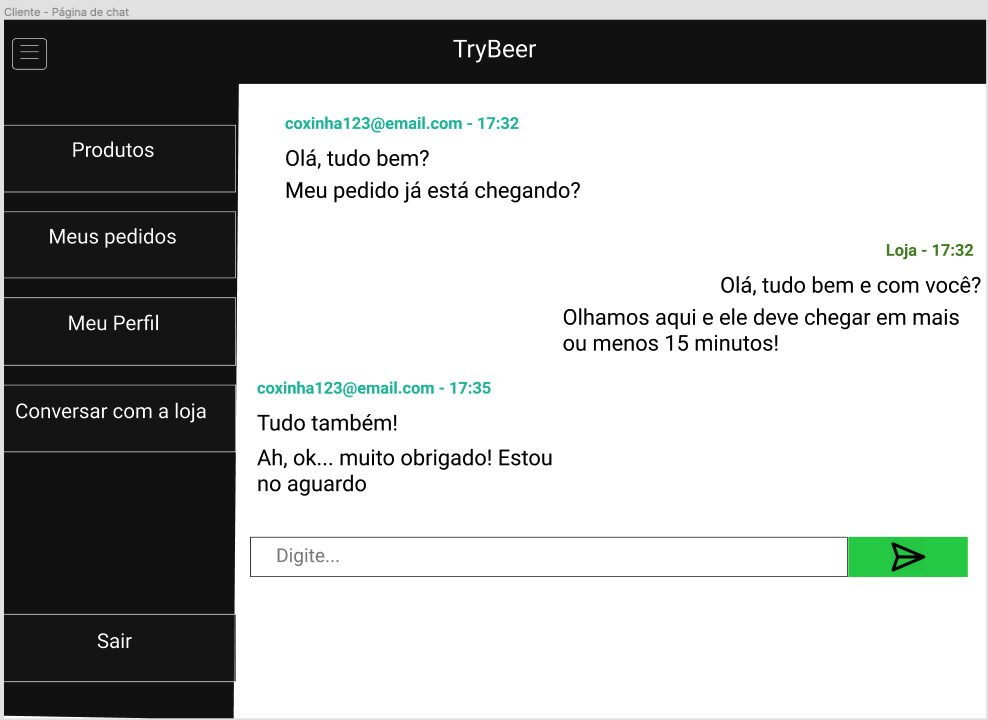

# 35 Trybeer v2

## :page_with_curl: React | Node | MySQL | MongoDB <br /><br />

### O objetivo do projeto era criar um app FullStack de entrega de comida, do zero. Para o FrontEnd utilizamos React, com ContextAPI para compartilhamento de estado. para o BackEnd utilizamos Node (Express), e a biblioteca <span>Socket.io</span> para a criação de um Chat em tempo real. Foram criados dois bancos de dados, um utilizando MySQL (com o ORM Sequelize) para o cadastro de usuários, pedidos e produtos; e outro utilizando MongoDB, para o cadastro das mensagens do chat.
---

## Resultado:


## Vídeo:


# Requisitos do projeto

### 1 - Desenvolver os status para o pedido da tela de `Detalhe pedido` do Administrador

- Todo pedido realizado deve ter um status referente ao seu progresso atual.

- Os `status` do pedido devem ser os seguintes:

   - `Pendente` logo quando o pedido for criado;

   - `Preparando` quando o pedido for iniciado pelo usuário admin;

   - `Entregue` quando o pedido for finalizado pelo usuário admin;.

- O usuário admin deve ter o controle de alterar o status do pedido. Lembre-se de seguir princípio `Open/Closed` de _SOLID_ para está implementação de forma que possam ser acrescentados novos comportamentos e `status` sem impactar os status já existentes.

- Qualquer atualização feita no pedido pelo usuário admin deve se refletir em tempo real para o cliente.

#### Tela de `Detalhe pedido` do Administrador

- O botão 'Preparar pedido' deverá conter a tag `data-testid="mark-as-prepared-btn"`


#### Além disso,as seguintes verificações serão feitas:
```
- Dado que é feito uma compra, será validado que ela está com status `Pendente` na tela de `Detalhes do pedido` do admin

- Será validado que o administrador ao acessar um determinado pedido ele deve visualizar o botão `Preparar Pedido`

- Será validado que o administrador ao acessar um determinado pedido ele deve visualizar o botão `Marcar como entregue`

- Quando clicar no botão `Preparar pedido` deve alterar o status do detalhe do pedido para `Preparando`

- Quando clicar no botão `Marcar como entregue` deve alterar o status do detalhe do pedido para `Entregue`

- Quando clicar no botão `Marcar como entregue` os botões `Preparar pedido` e `Marcar como entregue` devem sumir da tela
```

### 2 - Desenvolver os status para o pedido da tela `Pedidos` do Administrador
- Todo pedido realizado deve ter um status referente ao seu progresso atual.

- Os `status` do pedido devem ser os seguintes:

   - `Pendente` logo quando o pedido for criado;

   - `Preparando` quando o pedido for iniciado pelo usuário admin;

   - `Entregue` quando o pedido for finalizado pelo usuário admin;

#### Tela de `Pedido` do Administrador


#### Além disso,as seguintes verificações serão feitas:
```
- Dado que é feito uma compra, será validado que ela está com status `Pendente` na tela de `Pedidos` do admin

- Dado que o pedido foi marcado como entregue será validado que na tela de `Pedidos` do admin, o status estará como `Entregue`

- Dado que o pedido foi marcado como preparando será validado que na tela de `Pedidos` do admin, o status estará como `Preparando`
```

### 3 - Desenvolver os status para o pedido da tela `Pedidos do Cliente`

- Todo pedido realizado deve ter um status referente ao seu progresso atual.

- Os `status` do pedido devem ser os seguintes:

   - `Pendente` logo quando o pedido for criado;

   - `Preparando` quando o pedido for iniciado pelo usuário admin;

   - `Entregue` quando o pedido for finalizado pelo usuário admin;.

#### Tela de `Pedidos` do Cliente


#### Além disso,as seguintes verificações serão feitas:
```
- Dado que é feito uma compra, será validado que ela está com status `Pendente` na tela de `Meus pedidos` do cliente

- Dado que o admin marcou o pedido como `Preparando` é verificado que na tela de `Pedidos` do cliente o status mudou para `Preparando`

- Dado que o admin marcou o pedido como `Entregue` é verificado que na tela de `Pedidos` do cliente o status mudou para `Entregue`
```

### 4 - Desenvolver os status para o pedido da tela `Detalhes de Pedido` do Cliente

- Todo pedido realizado deve ter um status referente ao seu progresso atual.

- Os `status` do pedido devem ser os seguintes:

   - `Pendente` logo quando o pedido for criado;

   - `Preparando` quando o pedido for iniciado pelo usuário admin;

   - `Entregue` quando o pedido for finalizado pelo usuário admin;.

#### Tela de `Detalhes de Pedido` do Cliente


#### Além disso,as seguintes verificações serão feitas:
```
- Dado que é feito uma compra, será validado que ela está com status `Pendente` na tela de `Detalhes do pedido` do cliente

- Dado que o admin marcou o pedido como `Preparando` é verificado que na tela de `detalhe do pedido` do cliente o status mudou para `Preparando`

- Dado que o admin marcou o pedido como `Entregue` é verificado que na tela de `detalhe do pedido` do cliente o status mudou para `Entregue`
```

### 5 - Criar um botão no sidebar para acessar o chat do cliente

- Essa funcionalidade só deve existir na **visão de cliente**

- Adicionar ao menu lateral, uma botão de chat denominada `Conversar com a loja`.

    - Um clique no item descrito como `Conversar com a loja` deve levar para uma página de chat.

    - A rota da tela deve ser `/chat`;

#### Sidebar do Cliente

- O botão 'Conversar com a loja' deverá conter a tag `data-testid="side-menu-chat"`


#### Além disso,as seguintes verificações serão feitas:
```
- Será validado que o botão `Conversar com a loja` existe no sidebar do cliente

- Será validado que ao clicar no menu `Conversar com a loja` será redirecionado para página na url `/chat`
```

### 6 - Desenvolver funcionalidade de chat na visão de cliente

- Essa funcionalidade só deve existir na **visão de cliente**

- Na página de chat, as mensagens devem aparecer ordenadas com as mais recentes embaixo.

    - A página deve mostrar as mensagens enviadas e recebidas, com as mensagens mais recentes mais embaixo.

    - A página deve ter um input para digitar o texto e um botão para envio de nova mensagem ao chat.

- O nickname do cliente deve ser o email cadastrado.

- O chat deve conter tambem a hora que a mensagem foi enviada.

- A hora deve ter o formato `15:30`.

- O histórico da conversa deve ser salvo no banco de dados `MondoDB` e aparecer quando a pessoa abre a página.

#### Tela do Detalhe de chat do cliente

- O elemento com o nickname do cliente deverá conter a tag `data-testid="nickname"`

- O elemento com a data da mensagem deverá conter a tag `data-testid="message-time"`

- O elemento com a mensagem do cliente deverá conter a tag `data-testid="text-message"`

- O input de escrever a mensagem deverá conter a tag `data-testid="message-input"`

- O botão para enviar a mensagem deverá conter a tag `data-testid="send-message"`



#### Além disso,as seguintes verificações serão feitas:
```
- Será validado que existe o campo input e o botão de enviar mensagem

- Será validado que ao enviar mensagem o `nickname` do cliente é o seu email

- Será validado que ao enviar mensagem a data fica visível na tela

- Será validado que ao enviar mensagem a mensagem fica visível na tela

- Será validado que ê possivel enviar várias mensagens
```

### 7 - Criar botão no sidebar para acessar a lista de chats do administrador

- Essa funcionalidade só deve existir na **visão de admin**

- A plataforma deve ter acessível, no menu lateral, uma funcionalidade de chats denominada `Conversas`.

    - Um clique no item descrito como `Conversas` deve levar para uma página de listas de chats.

    - A rota da tela deve ser `/admin/chats`;

#### Sidebar Administrador

- O botão 'Conversas' deverá conter a tag `data-testid="side-menu-item-chat"`


#### Além disso,as seguintes verificações serão feitas:
```
- Será validado que no meu sidebar contém o botão `Conversas`

- Será validado que ao clicar no menu `Conversas` será redirecionado para página na url `/admin/chats`
```

### 8 - Criar funcionalidade de lista de conversas de chat na visão de administrador

- Essa funcionalidade só deve existir na **visão de admin**

- A paginá deverá conter uma lista de conversas lista com todas as conversas da loja.

    - As conversas devem aparecer numa lista. Cada conversa deve ser identificada pelo email da pessoa cliente em questão.

        - Um clique no email do cliente deve redirecioanar para a janela com o chat daquela conversa.

    - A lista de conversas deve ser ordenada pela data da última mensagem.

    - Caso não tenham conversas, deve ser exibido o texto "Nenhuma conversa por aqui".

#### Tela de listas de conversas

  - O texto `Nenhuma conversa por aqui` deverá conter o data-testid="text-for-no-conversation"

  - O texto com email do cliente deverá conter o `data-testid="profile-name"`

  - O texto com a última mensagem deverá conter o `data-testid="last-message"`

  - Os cards do chat devem conter o `data-testid="containerChat"`

  

#### Além disso,as seguintes verificações serão feitas:
```
- Será validado que ao entrar na tela de `admin/chats` e não houver conversas e validado se contém o texto `Nenhuma conversa por aqui`

- Será validado que ao entrar na tela de `admin/chats` e existir uma conversa verifico se contém o card

- Será validado que ao entrar na tela de `admin/chats` e existir uma conversa verifico se dentro do card contem o email do cliente

- Será validado que ao entrar na tela de `admin/chats` e existir uma conversa verifico se dentro do card contem data da ultima mensagem

- Será validado que ao clicar no card da conversa e redirecionado pra conversa
```

### 9 - Desenvolver funcionalidade de chat na visão de administrador

- Um clique num item da lista de conversas deve exibir na tela o respectivo chat.

    - Um clique em um item da lista deve exibir na tela a janela com o chat daquela conversa.

    - O _nickname_ da loja na conversa deve ser "Loja".

    - A página da conversa deve mostrar, no topo da tela, o email do usuário que a Loja está conversando.

    - A página da conversa deve ter um botão de voltar que ao ser clicado redireciona a pessoa a página de listagem de conversas novamente.

- O histórico de cada conversa deve ser salvo no banco de dados e aparecer quando a pessoa abre a página.

- A lista de conversas deve ser ordenada pela data da última mensagem.

    - A lista de conversas deve ser ordenada pela data da última mensagem (recebida ou enviada), as mais recentes no topo da lista.

#### Tela de chat do admin


  - O campo input de mensagem deverá conter a tag `data-testid="message-input"`

  - O botão de enviar mensagem deverá conter a tag `data-testid="send-message"`

- O email da mensagem deverá conter a tag `data-testid="nickname"`

- A hora da mensagem deverá conter a tag `data-testid="message-time"`

- O texto da mensagem deverá conter a tag `data-testid="text-message"`

- O botão voltar deverá conter a tag `data-testid="back-button"`

#### Além disso,as seguintes verificações serão feitas:
```
- Será validado que ao clicar no card da conversa poderá ser visualizado as mensagem do cliente

- Será validado que é possivel enviar mensagem

- Será validado que ao enviar mensagem o nickname do admin e `Loja`

- Será validado que ao enviar mensagem e listado a hora do envio da mensagem

- Será validado que é possivel voltar pra tela de `admin/chat` através do botão voltar

- Será validado que é possivel enviar mensagem para o cliente e a mensagem poderá ser visualizada pelo cliente
```

### 10 - Desenvolva a cobertura de testes unitários do back-end

- A cobertura de testes unitários do back-end deve ser de, no mínimo, 90%.

# Requisitos bônus

### 11 - Realizar o deploy do projeto back-end e front-end

#### Deploy Heroku

IMPORTANTE: Crie uma variável de ambiente com o nome `GITHUB_USER` deverá ser criada com o seu usuário do github.

#### Faça o deploy do front-end:

Crie um app do Heroku com o front-end. Não é necessário a criação do Procfile aqui. Vamos deixar o Heroku utilizar as configurações padrões. No momento de criar o app do Heroku, utilize o buildpack descrito abaixo, em Dicas.

O nome do seu app no heroku deve ser seu nome de usuário do github seguido de "-front". Por exemplo, se o seu usuário do github for "joao", o nome do seu app será "joao-front" e a url precisar ser https://joao-front.herokuapp.com/.

 #### Faça o deploy do back-end:

Crie um app do Heroku com o back-end. Não é necessário a criação do Procfile aqui. Vamos deixar o Heroku utilizar as configurações padrões. No momento de criar o app do Heroku, utilize o buildpack descrito abaixo, em Dicas.

O nome do seu app no heroku deve ser seu nome de usuário do github seguido de "-back". Por exemplo, se o seu usuário do github for "joao", o nome do seu app será "joao-back" e a url precisar ser https://joao-back.herokuapp.com/.

Configure as variáveis de ambiente do app para apontar para as API's publicadas.

Faça o deploy com o git.

- Sera validado se é possivel acessar a aplicação e verificar se estou na tela url de login

- Será validado que é possível fazer cadastro de um cliente com sucesso e ser redirecionado para tela de produtos

### 12 - Desenvolva a cobertura de testes unitários do front-end

- A cobertura de testes unitários do front-end deve ser de, no mínimo, 90%.

---
